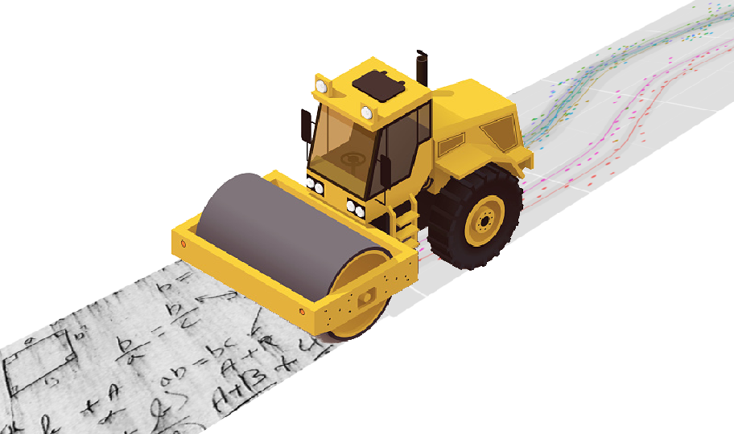

------
SteamRoller |Logo|
------

SteamRoller is a framework for testing the performance of various machine learning models on different tasks in the broad area of "text classification".  It is designed to make it extremely easy to define new classification tasks, and new models, and drop them in to compare ther characteristics.  It discourages doing anything "special" for different tasks, models, or combinations thereof, to ensure the comparisons are fair and expose all the costs incurred by the different choices.

SteamRoller's user-facing functionality is reflected by four submodules:

1. tasks
2. models
3. metrics
4. plots

Under the hood, SteamRoller has three additional submodules:

1. tools
2. scons
3. ui

As explained below, changes to the code are usually unnecessary, as the most common conceptual classes (tasks and models) can be extended simply by editing the configuration file.

------
Getting started
------

SteamRoller and its dependencies can be installed with ``pip install steamroller --user``.  An empty directory can be initialized for performing experiments by executing ``steamroller init`` from therein.  This creates two files: *SConstruct*, and *steamroller_config.py*: you then need to copy a suitable data file into place, e.g. ``cp lid.tgz sample_data.tgz``.  You can then run ``steamroller run`` to perform the predefined experiments, and ``steamroller serve`` to launch the results web server.  Most of SteamRoller's extensibility is through editing *steamroller_config.py*, while more advanced users may find it useful to edit *SConstruct*.

----
Using an HPC Grid
----

By default, *steamroller_config.py* has ``GRID=False``, and experiments will run serially on the local machine.  If you are running on an HPC grid like Univa, Sun Grid Engine, or Torque, setting ``GRID=True`` instructs SteamRoller to run experiments via the *qsub* command.  Since the jobs are distributed across the grid, the invocation of SteamRoller will submit them and then *wait* until they have completed, polling the scheduler and printing the current number of running jobs.  If you interrupt the SteamRoller command in this state, *the grid jobs will continue to run*, so you can either allow them to do so (e.g. if the interruption was accidental), or manually kill the running jobs with a command like ``qdel -u USERNAME``.  The latter is particularly important if you want to change and rerun experiments, as otherwise you may have multiple jobs simultaneously building the same output file.

----
Inspecting results
----

Once the experiments have finished, you will want to compare their performance.  Generally, the final product of a set of SteamRoller experiments is a plot of some metric (accuracy, run-time, memory usage, etc) with respect to some other variable (number of training examples, hyper-parameter value, etc).  Running ``steamroller serve`` will, by default, start a web server at *http://localhost:8080* with links to the plots generated for each task, or you can examine the figures directly in the *work/* subdirectory.

----
Defining a new task
----

In SteamRoller, a *task* is simply a pointer to documents annotated with discrete labels.  For example, the default *steamroller_config.py* file has the following entry::

   TASKS = [
     {"name" : "SampleData",
      "file" : "sample_data.tgz"
     }
   ]

That's it.  We use the *Concrete* data format, so the file is a tar archive where each entry is a *Communication* object, but SteamRoller has functionality to convert simple text formats.  If your data is a text file with lines in tab-separated format::

  ID LABEL TEXT

you can create an appropriate Concrete tar archive by running ``python -m steamroller.tools.convert -i TEXT_FILE -o TAR_FILE``.  Make sure that any tab characters in the text column are appropriately escaped (SteamRoller uses Python's *csv* module).
  
----
Defining a new model
----

A *model* in SteamRoller is defined by the command-line processes for:

1. Training based on some data
2. Applying to some new data

Looking again at the default *steamroller_config.py*, there is an entry::

  MODELS = [
      {"name" : "SVM",
      "train_command" : "python -m steamroller.models.scikit_learn --type svm --train ${SOURCES[0]} --input ${SOURCES[1]} --output ${TARGETS[0]} --max_ngram ${MAX_NGRAM}",
      "apply_command" : "python -m steamroller.models.scikit_learn --type svm --model ${SOURCES[0]} --test ${SOURCES[1]} --input ${SOURCES[2]} --output ${TARGETS[0]}",     
      },
    ]

*train_command*, when the template strings are replaced by SteamRoller, will train an SVM based on an input file (i.e. the tar archive mentioned earlier) and a train file that is a list of indices in the tar file.  The resulting SVM is serialized into the output file.  Note the MAX_NGRAM template string: this is a *hyper-parameter* that you might set directly in the *steamroller_config.py* file, or perhaps perform grid search over to find optimal values.

*apply_command*, again once the template strings are replaced, will read in a serialized SVM and apply it to the instances specified in *--test*.  It writes log-probabilities to the output file in the tab-separated format::

  ID     GOLD   LABEL1 LABEL2 ...
  321321 LABEL2 -.03   -.0025

SteamRoller comes with several common models predefined based on the Scikit-Learn suite, which is why these commands are invoking parts of SteamRoller itself, but the only requirement is that the commands meet the criteria described above and can run on the relevant machines (locally or across a grid).
  
----
FAQ
----

